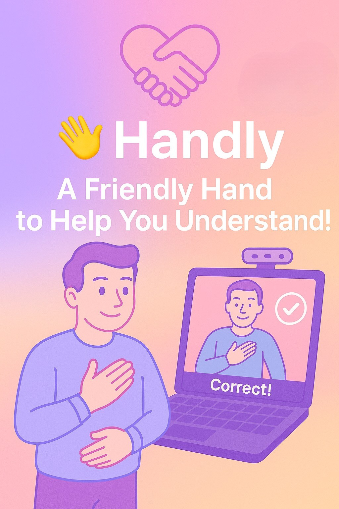

# 💡 Handly - Sign Language Learning App  
_A Friendly Hand to Help You Understand!_

<!-- cool project cover image -->



## Table of Contents
- [The Team](#the-team)
- [Project Description](#project-description)
- [Getting Started](#getting-started)
  - [Prerequisites](#prerequisites)
  - [Installing](#installing)
- [Testing](#testing)
  - [Sample Tests](#sample-tests)
- [Deployment](#deployment)
- [Built With](#built-with)
- [Acknowledgments](#acknowledgments)

---

## 👥 The Team 

**Team Members**
- [Yael Batat](mailto:yael.batat@mail.huji.ac.il)
- [Shir Babian](mailto:shir.babian@mail.huji.ac.il)

**Supervisor**
- [Gal Katzhendler ](mailto:gal.katzhendler@mail.huji.ac.il)

---

## 📚 Project Description

**Handly** is an interactive educational app that helps users learn sign language through real-time, guided feedback and gesture analysis.

### Key Features:
- Real-time sign language recognition using pose estimation.
- Visual feedback highlighting specific errors in user's gestures.
- Step-by-step guided practice using frame-by-frame pose comparison.
- 1500+ signs available for practice.
- Integrated games (quizzes, bubble shooter) for reinforcement.
- Progress dashboard with user accuracy and streak tracking.

### Main Components:
- Pose detection using MediaPipe.
- K-Nearest Neighbors (KNN) classifier for correctness.
- Sign embedding using the MMPT SignCLIP model.
- Google Drive API integration for data access.
- PyQt5 GUI for desktop interaction (Mac & Windows).

### Technologies Used:
- Python
- MediaPipe
- PyQt5
- scikit-learn
- Google Drive API
- pygame
- gTTS
- OpenCV
- NumPy

---

## ⚡ Getting Started

These instructions will help you get the app up and running locally on Mac or Windows.

### 🧱 Prerequisites

Install the following Python packages (via `pip` or `requirements.txt`):

- `numpy`  
- `opencv-python`  
- `PyQt5`  
- `google-api-python-client`  
- `pose-format`  
- `mediapipe`  
- `scikit-learn`  
- `requests`  
- `google-auth`  
- `google-auth-oauthlib`  
- `gtts`  
- `pygame`  

> You’ll also need permission to access our Google Drive files — see below.

### 🏗️ Installing

1. **Clone the Repository**

```bash
git clone https://github.com/YOUR_USERNAME/handly.git
cd handly
```

2. **Choose Your Platform Folder**

```bash
# For Mac
cd handlyForMac

# For Windows
cd handlyForWindow
```

3. **Clone the Required Fairseq Repository**

```bash
git clone https://github.com/J22Melody/fairseq.git
```

Make sure the directory looks like this:

```
handly/
├── handlyForMac/
├── handlyForWindow/
├── fairseq/
│   └── examples/MMPT/
```

4. **Request Access to Google Drive API**

To access sign videos and pretrained data:

- 📧 [yael.batat@mail.huji.ac.il](mailto:yael.batat@mail.huji.ac.il)
- 📧 [shir.babian@mail.huji.ac.il](mailto:shir.babian@mail.huji.ac.il)

We will provide credentials and setup instructions.

---
## 🧪 Testing

You can test the system by either recording your own sign or uploading a video (e.g., from the internet) to verify whether the system correctly classifies the gesture and provides appropriate feedback.

### ✅ What to Test

- Whether the system recognizes the sign as **correct** or **incorrect**
- Whether the **visual feedback** clearly shows what was done right or wrong
- Whether the **guided practice mode** helps correct inaccurate signs

### 🧪 How to Test

#### 1. **Live Recording**
- Run the app — it will **randomly assign** a sign for you to perform.
- Record yourself using your webcam.
- Try different variations:
  - Perform the sign correctly and see if it’s accepted
  - Perform it incorrectly to test the feedback system
  - Vary angles, hand position, or speed

#### 2. **Using Pre-recorded Videos**
- Wait for the app to assign a random sign (e.g., “hello”).
- Download two videos from the internet:
  - One showing the **correct** version of the sign
  - One showing an **incorrect** or different sign
- Upload each video to the app as input.

#### 🔁 Don’t Know the Assigned Sign?
- Click the **“Get a new sign”** button to randomly generate another one.
- Repeat until you receive a sign you recognize or can find videos for online.

### 🧪 Sample Test

1. Launch the app  
2. The system assigns a random sign — for example, **"hello"**
3. Find two videos online:
   - One showing someone correctly performing "hello"
   - One showing an incorrect or unrelated gesture
4. Upload each video in turn

**Expected Results:**
- ✅ The correct video should be classified as **correct**
- ❌ The incorrect video should be classified as **incorrect**, with **visual feedback** showing where it deviates
- If incorrect, the system may trigger **guided practice mode**, pausing until your pose matches the reference

---

## 🚀 Deployment

To deploy on a live system (for demonstration or classroom use):

- Ensure internet access for Google Drive API.
- Preload sign video cache locally for faster access.
- Run the appropriate version from `handlyForMac` or `handlyForWindow`.

No cloud server is required; the app runs fully on the client machine.

---

## ⚙️ Built With

- [MediaPipe](https://github.com/google/mediapipe) – Pose estimation  
- [fairseq MMPT (SignCLIP)](https://github.com/J22Melody/fairseq/tree/main/examples/MMPT) – Sign gesture embedding  
- [Google API Python Client](https://github.com/googleapis/google-api-python-client) – Drive integration  
- [PyQt5](https://pypi.org/project/PyQt5/) – GUI  
- [scikit-learn](https://scikit-learn.org/) – KNN model  
- [pygame](https://www.pygame.org/) – Game interfaces  
- [gTTS](https://pypi.org/project/gTTS/) – Text-to-speech feedback

---

## 🙏 Acknowledgments

- Based on the amazing work of the [MMPT Research Group](https://github.com/J22Melody/fairseq/tree/main/examples/MMPT)
- Thanks to Google for MediaPipe and Drive API tools
- Special thanks to Gal Katzhendler for his supervision and guidance
- Inspired by the need for inclusive, interactive educational tools for ASL
